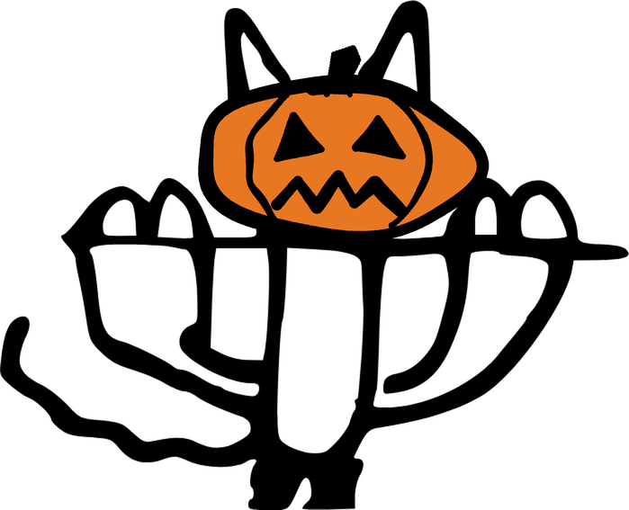

```{r footer-env}
#| echo: false
#| message: false
#| warning: false

# Archive links contain secrets and live in .env.
source("../R/publishing.R")
for (footer_env_path in c(".env", "../.env", "../../.env")) {
  if (file.exists(footer_env_path)) {
    dotenv::load_dot_env(footer_env_path)
    break
  }
}
```

## Additional resources

- **CanadaLogin dashboards**
    - **Sign-In Activity dashboard** ([dashboard](`r published_url("ibm-verify.html")`) | [code](https://github.com/cds-snc/canadalogin-reporting-dashboards/tree/main/dashboards/ibm-verify)) - covers users and sign-in events.
    - **Support dashboard** ([dashboard](`r published_url("support.html")`) | [code](https://github.com/cds-snc/canadalogin-reporting-dashboards/tree/main/dashboards/support)) - covers call centre volume and partner support.
- **CanadaLogin Metrics Cookbook** ([website](https://cds-snc.github.io/canadalogin-metrics-cookbook/) | [repo](https://github.com/cds-snc/canadalogin-metrics-cookbook)) - how each metric is defined and calculated, and what data is available.
- **Signal Check report archive** ([CDS Google Drive](`r Sys.getenv("FOOTER_ARCHIVE_GDRIVE_URL")`) | [ESDC SharePoint](`r Sys.getenv("FOOTER_ARCHIVE_SHAREPOINT_URL")`)) - past editions of this report<a id="cat-trigger" href="#" title="">.</a>

<!--
Spooky copy of _footer.qmd for October editions. Adds the pumpkin cat, burnt
orange links, and a bat in the title block. Keep the links in step with
_footer.qmd.
-->
<style>
/* Burnt orange, 5.3:1 on white (brand orange fails AA for text). */
:root {
  --bs-link-color: #B04E0F;
  --bs-link-color-rgb: 176, 78, 15;
  --bs-link-hover-color: #8A3D0C;
  --bs-link-hover-color-rgb: 138, 61, 12;
}
#title-block-header { position: relative; }
#spooky-bat {
  position: absolute;
  top: 0.25rem;
  right: 0;
  width: 90px;
  transform: rotate(8deg);
}
#cat-trigger { color: inherit; text-decoration: none; }
#cat-egg {
  position: fixed;
  right: 1.5rem;
  bottom: -25px;
  width: 240px;
  max-width: 38vw;
  z-index: 9999;
  transform: translateY(112%);
  transition: transform 0.55s cubic-bezier(0.22, 1, 0.36, 1);
  cursor: pointer;
  pointer-events: none;
}
#cat-egg.cat-visible {
  transform: translateY(0);
  pointer-events: auto;
}
#cat-egg img { display: block; width: 100%; height: auto; }
#cat-egg .cat-caption {
  text-align: center;
  font-weight: 700;
  font-size: 1rem;
  letter-spacing: 0.02em;
  margin-bottom: 2px;
  color: #333;
  transform: rotate(-4deg);
}
</style>

<div id="cat-egg" onclick="this.classList.remove('cat-visible')">
  <div class="cat-caption">hang in there boo</div>
  
</div>


<script>
// The footer renders last, so move the bat up into the title block.
(function () {
  var bat = document.getElementById("spooky-bat");
  var header = document.getElementById("title-block-header");
  if (bat && header) header.appendChild(bat);
})();
(function () {
  var trigger = document.getElementById("cat-trigger");
  var egg = document.getElementById("cat-egg");
  if (!trigger || !egg) return;
  // Counts the first reveal per page only.
  var counted = false;
  trigger.addEventListener("click", function (e) {
    e.preventDefault();
    var shown = egg.classList.toggle("cat-visible");
    if (shown && !counted && typeof gtag === "function") {
      gtag("event", "easter_egg_cat");
      counted = true;
    }
  });
})();
</script>
